## Verktyg

För att bidra till Terror i Sverige behöver du följande.

### Git

_Git_ är ett system för att versionshantera kodbaser och textbaserade projekt.
Dessa projekt kommer refereras till som ett Git projekt eller ett _repository_.
Du kan läsa mer på vad Git är på 
[deras hemsida](https://git-scm.com/book/en/v2/Getting-Started-What-is-Git%3F).

### GitHub

_GitHub_ är en webbaserad Git lagrings tjänst. GitHub använder man för att spara
sina Git projekt på en server som alla kan få tillgång till.

Du kan skapa ett konto på GitHub via
[den här länken](https://github.com/signup).

### Github Desktop

Det enklaste sättet att komma igång med Git och GitHub är att använda GitHubs
verktyg [GitHub Desktop](https://desktop.github.com/). Det är ett program du kan
använda för att hämta hem dina projekt från internet, göra ändringar och skicka
upp till GitHub igen.

### Markdown

_Markdown_ är ett _markup språk_ som används för att formatera text. Det
fungerar nästan precis som en vanlig textfil (en `.txt` fil), men man kan enkelt
specificera rubriker och subrubriker, inkludera bilder och formatera text i
olika stilar. 

Om du vill kan du gå igenom [den här guiden](https://www.markdowntutorial.com)
för att lära dig mer om Markdown.

### Okular

Du kommer vilja kunna se hur ditt dokument ser ut medans du skriver på det. Det
enklaste sättet att rendera ut ett Markdown dokument är med hjälp av
[Okular](https://okular.kde.org/sv/). Okular är ett program för att öppna PDFer,
men om man öppnar en Markdown fil i det kommer den att renderas ut.

### Textredigerare

Markdown kan redigeras på samma sätt som en vanlig textfil. Du kan välja att
göra det i
[Microsoft Notepad](https://apps.microsoft.com/detail/9MSMLRH6LZF3?hl=en-US&gl=US),
[Notepad++](https://notepad-plus-plus.org/), eller
[Sublime Text](https://www.sublimetext.com/). Personligen rekommenderar jag
Sublime Text.

## Exempel

Följande är ett exempel på hur du ska använda alla dessa verktyg för att lägga
upp din scenarion. Vi kommer att skapa en scenarion som heter _Exempel_. Det
kommer vi göra igenom att hämta hem _Terror i Sverige_ projektet från
[GitHub](#github) med hjälp av [Github Desktop](#github-desktop). Sedan kommer
vi lägga till en egen [Markdown](#markdown) fil och lite bilder. Det kommer vi
göra med hjälp av [Sublime Text](#textredigerare) och [Okular](#okular). När vi
sedan är nöjd med vår scenarion kommer vi skapa en _commit_ till Terror i
Sverige projektet och skicka upp våra ändringar på [GitHub](#github). Dessa
ändringar kommer ligga i ett projekt på din profil, och för att be om att få
dina ändringar applicerade på hemsidan kommer vi att göra ett _pull request_.

## Steg 1 - Skapa en Github användare

Gå till [GitHub Signup](https://github.com/signup)

Det bör se ut såhär.

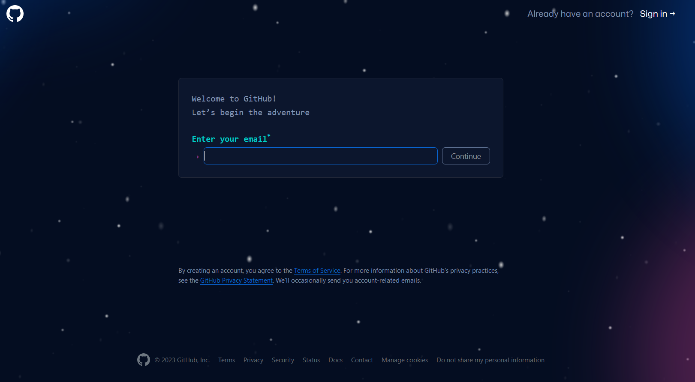

Skapa ett konto igenom att skriva in din mailaddress och ett lösenord. 

Välj ett användarnamn. Det här användarnamnet kommer du sedan att använda i dina
scenarion för att visa att det är du som har skapat scenariot och får göra
ändringar i den.

Användarnamnet för det här exemplet kommer att vara `terror-i-sverige-exempel`.
Men du väljer självfallet ett helt eget användarnamn.

Du kommer sedan behöva verifiera din mailaddress. Efter att du har gjort det är
ditt konto färdigt

### Steg 2 - Gör en fork på Terror i Sverige repot

Nu ska du göra det som kallas _en fork_ av Terror i Sverige projektet. En fork i
Git betyder att du tar ett projekt som tillhör någon annan och grenar av det
till en kopia som ligger på din profil.

Om du går till URLn för Terror i Sverige repot på GitHub ser det ut såhär.

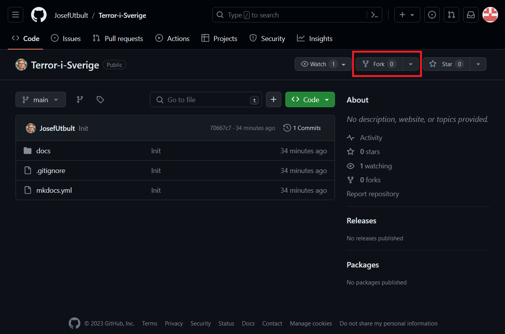

Notera att det här projektet ligger under användaren `JosefUtbult`. Det betyder
att du inte kan göra några direkta ändringar till det här projektet. Men du kan
göra en kopia på din profil igenom att trycka på `fork`. Då kommer du till en
sida som ser ut såhär.

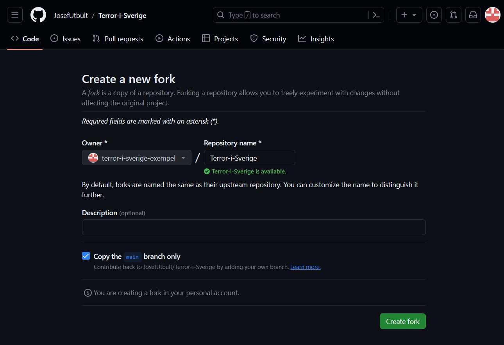

Du kan behålla namnet som det är, och lämna `Copy only the main branch` i-bockat.
Forstätt igenom att trycka `Create fork`.

Nu kommer du komma till en version av projektet som ser ut såhär. Notera att det
här projektet nu ligger under användaren `terror-i-sverige-exempel`.

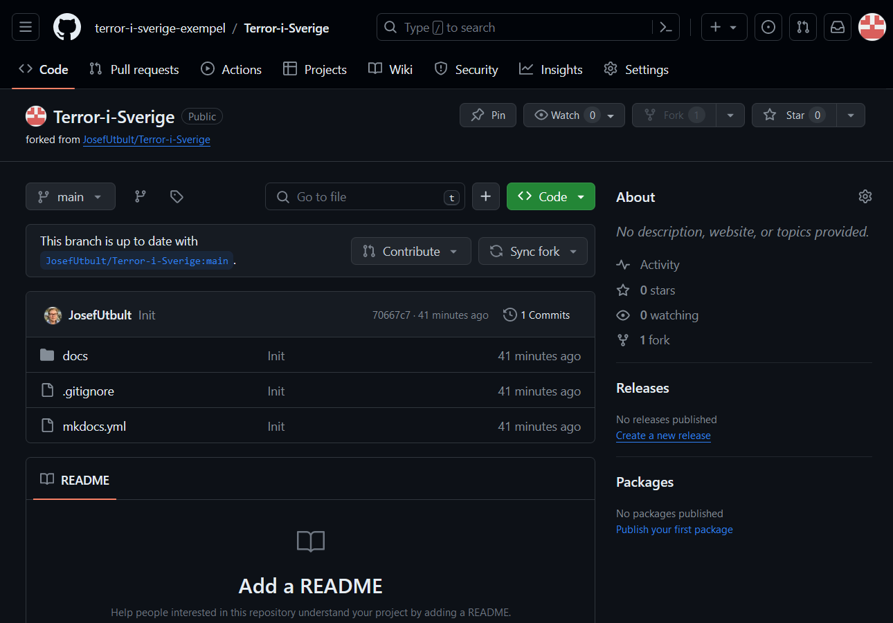

Du har nu lyckats göra en fork på projektet!

### Steg 3 - Logga in på GitHub Desktop

Nu kan du logga in på GitHub Desktop. Du kan ladda ner applikationen
[här](https://desktop.github.com/). Ladda ner och kör installeraren. Sedan
kommer du till en inloggning som ser ut såhär.

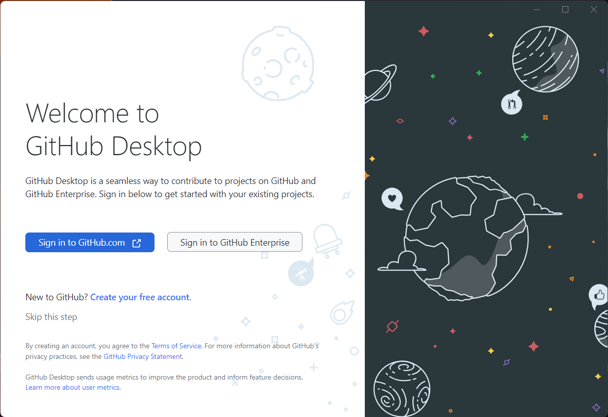

Där kan du välja att logga in på GitHub. När du klickar på `Sign in to GitHub`
kommer du till en autentiseringssida i din webbläsare som ser ut såhär.

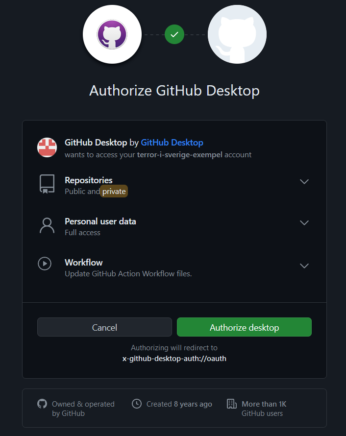

Godkänn med `Authorize desktop`. GitHub kommer sedan skicka tillbaks till GitHub
Desktop.

Nu kommer GitHub desktop be dig konfigurera Git. Det ser ut såhär.

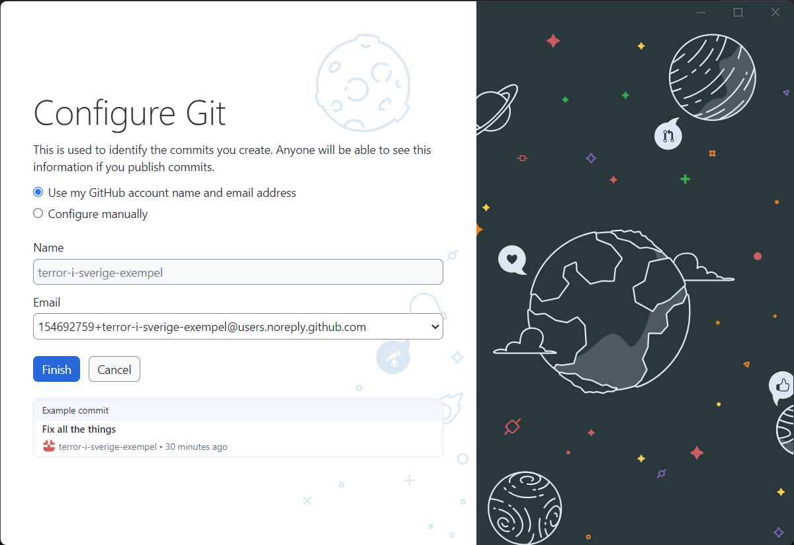

Du kan välja `Use my GitHub account name and email address` och sedan `finish`.

Nu kommer du till GitHub Desktops hemmskärm. Den ser ut såhär.

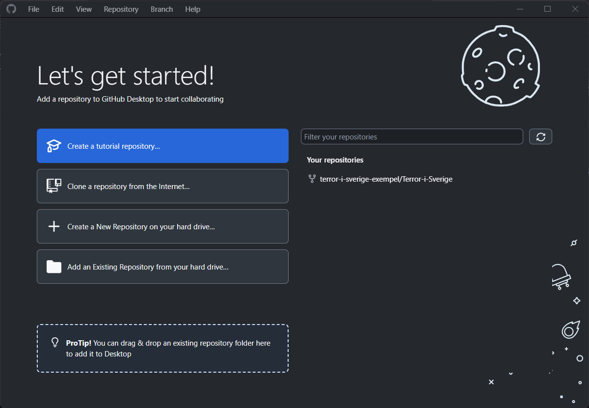

### Steg 4 - Klona Terror i Sverige repot

På GitHub Desktops hemmskärm kan du notera att det finns en rubrik som heter
`your repositories`. Under den kan du se ett repo som heter `<ditt
användarnamn>/Terror-i-Sverige`. Det är versionen av projektet som ligger på din
GitHub profil. Klicka på den och välj `clone <ditt
användarnamn>/Terror-i-Sverige`. Då kommer du till en skärm som ser ut såhär.

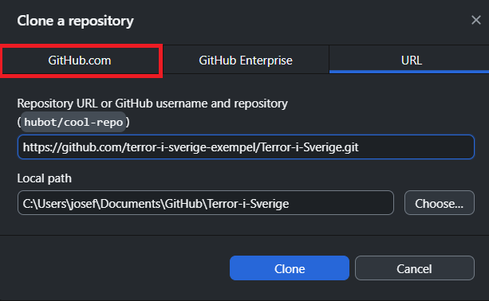

Gå till fliken `GitHub.com`. Där bör det se ut ungefär såhär.

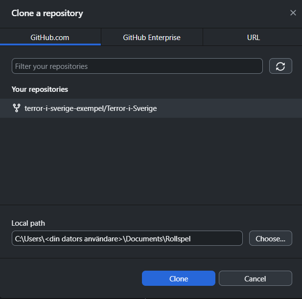

Där kan du återigen trycka på `<ditt användarnamn>/Terror-i-Sverige`. Du kan
också välja vart projektet ska ligga på din dator igenom att sätta `Local path`.
Vi kan testa det igenom att byta den till `Documents\Rollspel`. Du kommer behöva
skapa den mappen i `Documents`. Fortsätt sedan igenom att välja `Clone`.

Nu kommer du få upp en projektsida och en ruta där GitLab frågar om du vill göra
saker för förälderprojektet eller bara för din version av projektet. Efterssom
du kommer vilja skicka in dina ändringar till förälderprojektet så småning om
kan du välja `To contribute to the parent project` och fortsätta med `Continue`.

Nu kommer du komma direkt till din projektsida. Den bör se ut såhär.

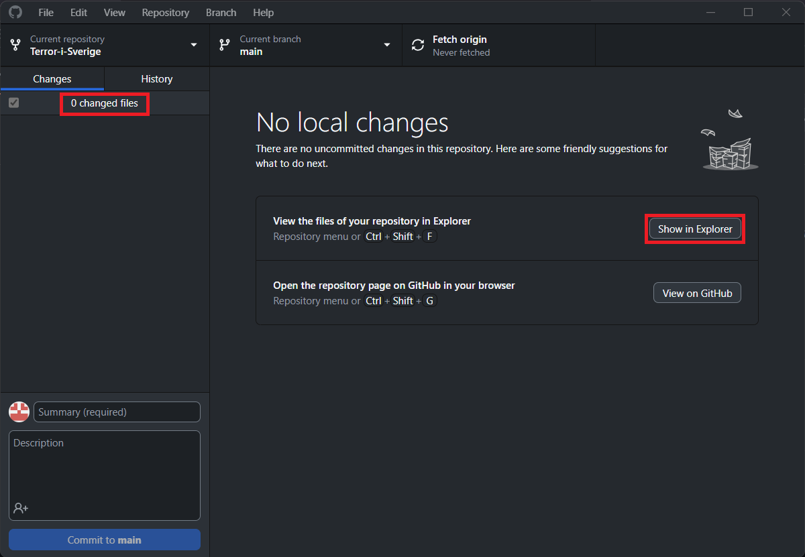

Notera att det står `0 changed files`. Det är för att du inte gjort några
ändringar i projektet ifrån hur det ser ut på GitHub. 

Du kan nu gå till ditt projekt i filhanteraren eller igenom att välja `Show in
Explorer`.

### Steg 5 - Skapa Ett Scenario

Nu är det dags att skapa en ny sida för ditt scenario. Börja med att gå till
projektmappen som vi lagt i `Documents\Rollspel\Terror-i-Sverige`. I den mappen
kan du gå in i submappen `docs\Scenarier\Nutid`. Där bör det ligga en massa
mappar och filer som slutar på `.md`. Det är Markdown filer.

Du kan nu öppna din textredigerare, i det här fallet [Sublime
Text](#textredigerare). Är det första gången du öppnar Sublime Text kommer det
att se ut ungefär såhär.

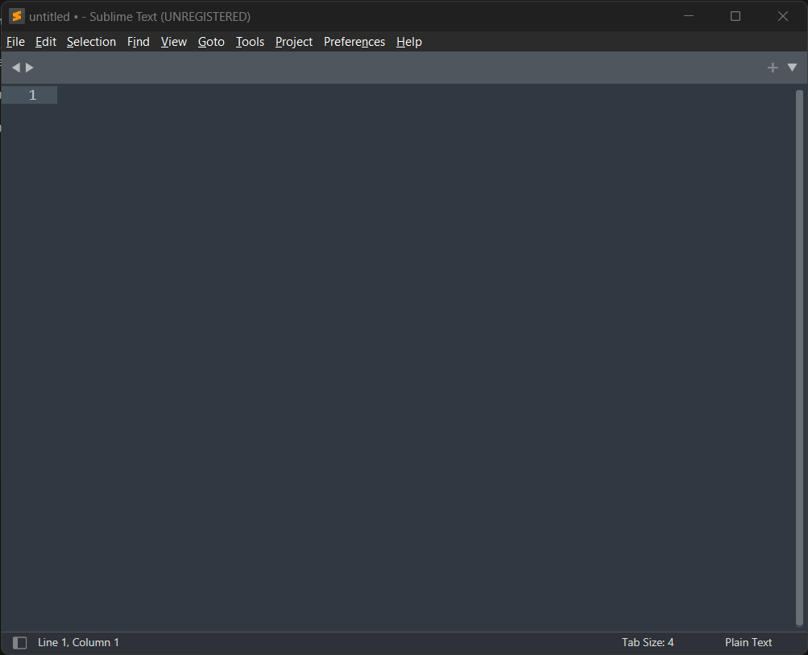

Uppe i vänstra hörnet kan du välja `File > Open Folder...`. Där kan du välja din
projektmapp `Documents\Rollspel\Terror-i-Sverige`. Nu kommer du få ett filträd
på vänster sida av skärmen som ser ut såhär.

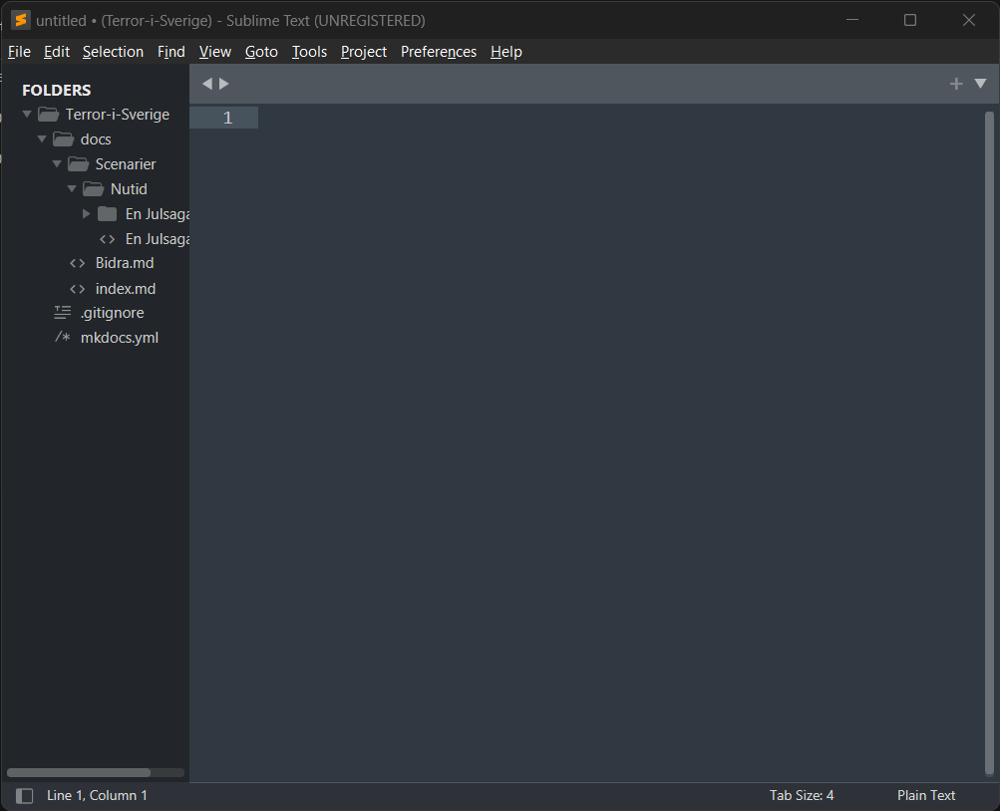

Nu vill du skapa en mapp för ditt scenario. Det här exemplet kommer utspela sig
i nutid, och ska därför ligga i `docs\Scenarion\Nutid`. Gå dit i din
filhanterare och högerklicka. Välj sedan `New > Folder` och döp den till namnet
på ditt scenario. I vårt exempel kan vi döpa mappen till `Exempel`. Då
vi kommer vilja använda bilder för vårt scenario kan du också skapa en mapp i
`Exempel` och döpa den till `img`.

Nu kan du skapa en Markdown fil för ditt scenarie i din mapp. Det gör du enkelt
i Sublime Text igenom att gå till `File > New file` eller igenom att trycka
`Ctrl + N`. Du kommer nu få upp en flik som heter `untitled`. När du nu sparar
filen igenom att gå till `File > Save file` eller igenom att trycka på `Ctrl +
S` kommer du få döpa om den.

Lägg din fil i din scenariomapp `docs\Scenarier\Nutid\Exempel`. Där kan du döpa
den till `Exempel.md`. Kom ihåg att filen måste sluta på `.md` för att det ska
bli en Markdown fil.

Du kan också lägga en bild i din `img` mapp. Högerklicka på den här bilden och
spara den. Döp den till `shadow-man.png` och lägg den i `img` mappen.

### Steg 6 - Skriv ditt scenario

TODO

Du kan även titta på hur din fil kommer att se ut igenom att öppna `Exempel.md`
i [Okular](#okular). Okular kan bete sig lite konstigt med fontstorlekar ibland,
men du kan öka den igenom att i Okular gå till `Settings > Configure Backend >
Markdown > Default Font`. Där kan du välja att öka eller minska din fontstorlek.

Så här ser exempelprojektet ut medans vi jobbar på det i Sublime Text och i
Okular.

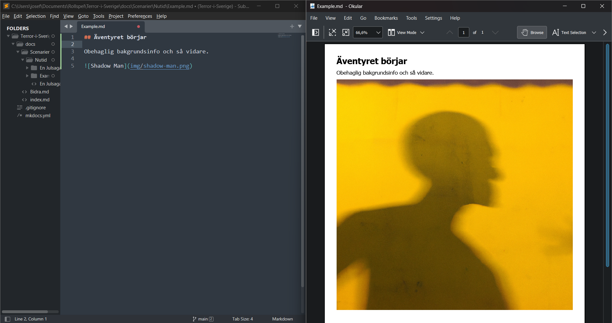

### Steg 7 - Ladda upp dina ändringar på GitHub

Nu när du gjort dina ändringar kan du åter igen öppna GitHub Desktop. Det kommer
nu se ut ungefär såhär.

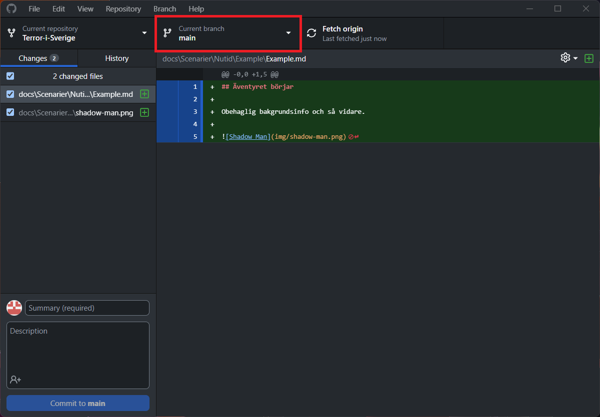

Notera att det står att två filer har ändrats. Den första är `Exempel.md` och
den andra är `shadow-man.png`. Du kan även se under `Exempel.md` exakt vilka
ändringar som gjorts, det vill säga att ett antal rader har lagts till.

Innan du applicerar dina ändringar till `main` branchen, så ska du få göra en
separat _branch_. En branch i Git betyder att du gör en separat versionshistorik
i ett projekt (ganska likt en fork, fast internt i projektet). Det vill du göra
för att dessa exempelsteg inte ska dyka upp på hemsidan, utan att du senare
enkelt kan bortse från de ändringar du gjort under guiden, och istället bara
applicera de ändringar du gör för framtida scenarion.

Börja med att trycka på `Current branch main`. Välj sedan `New Branch`. Döp din
branch till `exempelprojekt` och välj `Create branch`. 

Du kommer få en ruta som ser ut såhär.

Välj `Bring my changes to exampleproject`. Fortsätt sedan med `Switch branch`.

Nu är det dags att göra en _commit_ på ditt projekt. En commit i Git betyder att
du specificerar att du vill spara de ändringar du har gjort i en ny version.
Nere i vänstra hörnet finns en ruta där det står `Summary (required)`. Där kan
du skriva en beskrivning på de ändringar du gjort. I vårt fall kan vi skriva
_Jag la till ett exempelscenario_.

Välj sedan `Commit to exempelprojekt`.

Nu kommer du komma tillbaks till den här sidan.

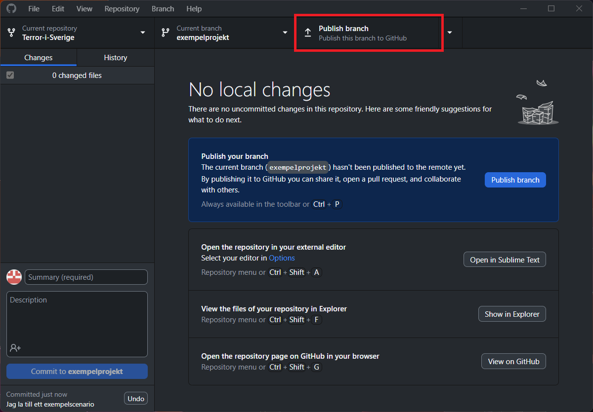

Det betyder att alla lokala ändringar du gjort på din dator också har commitats
till Git.

Nu kan du välja `Publish branch`. Gör du senare fler ändringar kommer det
istället stå `Push branch`, men resultatet blir detsamma.

Du har nu lyckats skicka upp dina ändringar till din version av projektet på
GitHub!

### Steg 8 - Skapa ett pull request

Nu är det dags att skapa ett _pull request_. Ett pull request i Git betyder att
du har en branch av projektet som du ber någon annan plocka in i sin version av
projektet. Det kan vara antingen in i en annan branch i din version av projektet
eller in i någon annans version av projektet.

I det här fallet så ska vi göra ett pull request _från_ vår branch
`exempelprojekt` i vår version av projektet _in i_ `main` branchen i versionen
av projektet som ligger under `JosefUtbult`.

Börja med att gå in på [GitHub](https://github.com/). Du bör komma till din
profil. I menyn till vänster kan du se dina projekt, varav din version av
projektet Terror i Sverige ligger. Tryck på den för att gå till projektet.

I projektet kan du välja vilken branch du ska kolla på. Tryck på `main` uppe i
vänstra hörnet och välj `View all branches`. Där kan du välja din branch
`exempelprojekt`.

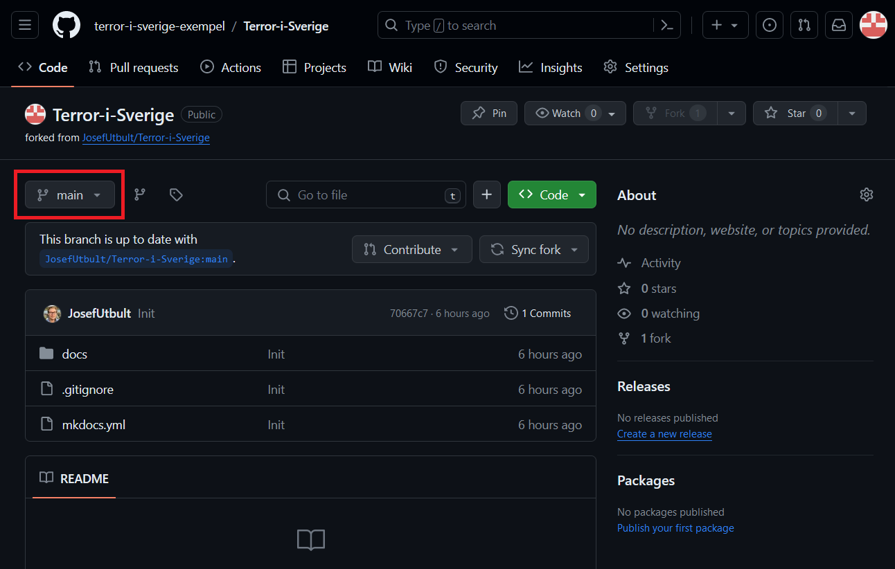

Nu bör du se ditt projekt från den branchen.

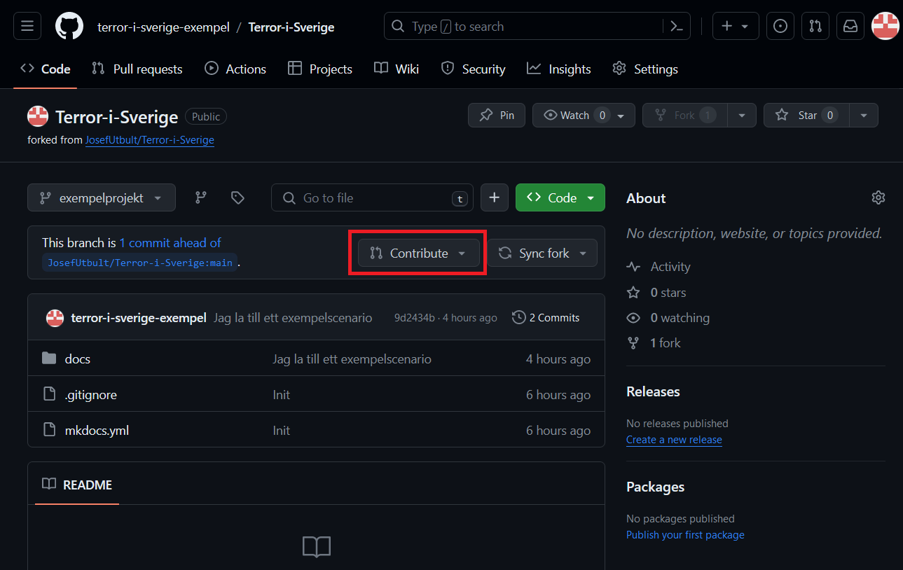

Notera att det står att `This branch is 1 commit ahead of
JosefUtbult/Terror-i-Sverige:main`. Den ändringen vill vi nu få in
huvudprojektet.

Tryck på `Contribute` och välj `Open pull request`. Det kommer nu se ut såhär.

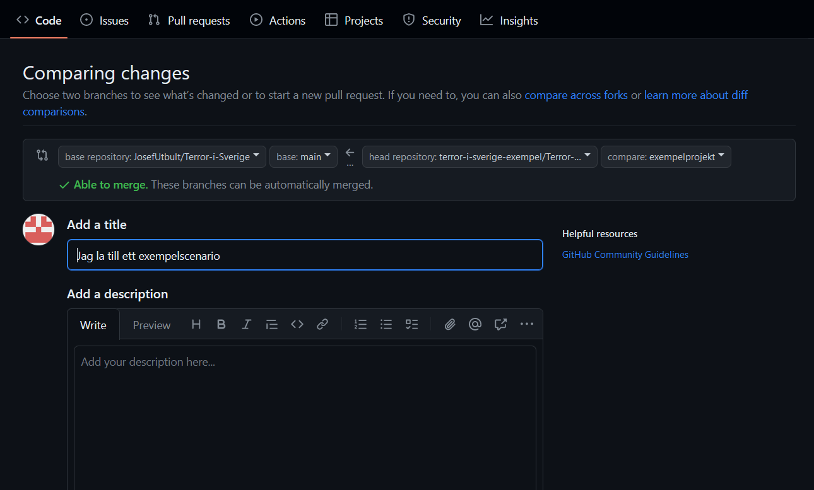

Notera att du har en pil som pekar från `terror-i-sverige-exempel` (ditt
användarnamn) branch `exempelprojekt` till `JosefUtbult` branch `main`. Det
betyder att du vill be om att få dina ändringar från din branch i din version av
projektet inlaggda i huvudversionens `main` branch.

Skriv ett litet medelande om vad du gjort, och en liten beskrivning över vad det
innefattar. Om det här vore ett faktiskt scenario som du gjort, och inte ett
exempelprojekt, så skulle du sedan trycka på `Create pull request`. **Tryck inte
på den för exemplet!**

### Steg 9 - Skapa ditt scenario

Nu är det dags för att skapa ditt egna scenario. För att inte allt det du gjort
i exemplet ska följa med i historiken in i huvudversionen, så ska du gå bort
från din branch tillbaks till main branchen.

Öppna GitHub Desktop. Den ser nu ut såhär. Tryck på `Current branch
exempelprojekt` och välj istället `main`.

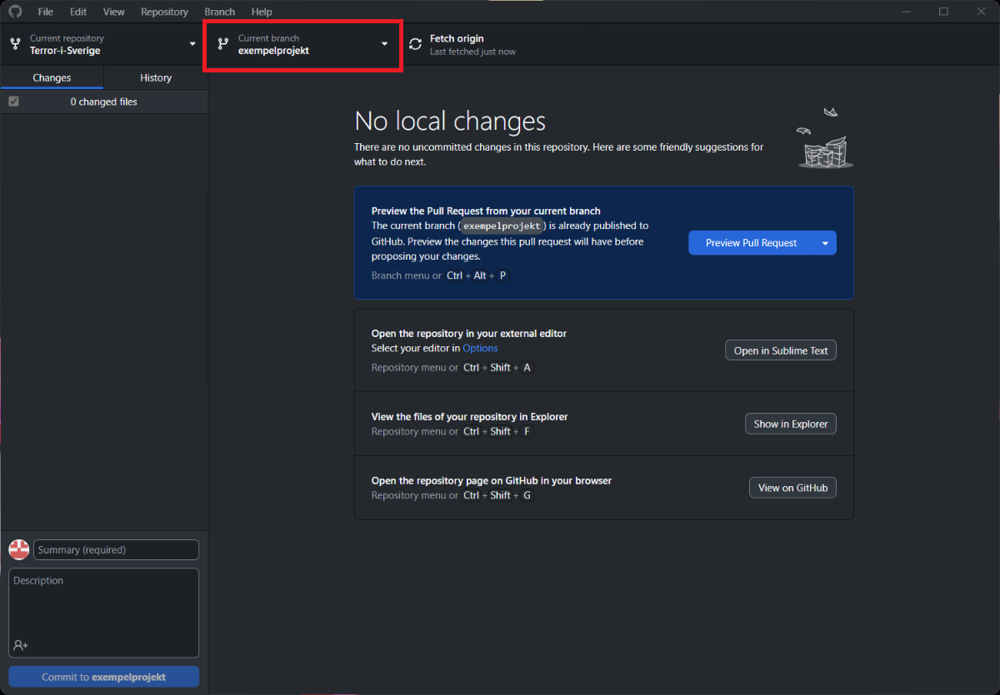

Nu kommer den ändringen du gjort i branchen `exempelprojekt` att tas bort och du
är tillbaks i samma stadie som ditt projekt var innan du gjorde dina ändringar.

Gå nu igenom alla steg igen, men istället för att använda alla dina exempelnamn
så använder du det riktiga namnet på ditt scenario. Gör sedan en commit på samma
sätt som tidigare fast i `main` branchen, och sedan ett pull request till
huvudversionen av projektet. Efter att du gjort ditt pull request kommer det att
granskas och antingen godkännas, godkännas men ändras lite, eller inte
godkännas. Målet är att allt ska godkännas, men om ditt Gitprojekt är allt för
kaotiskt kommer det inte att gå.

Hoppas den här guiden var till hjälp. Lycka till!
