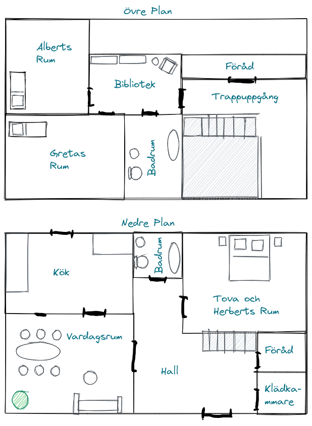
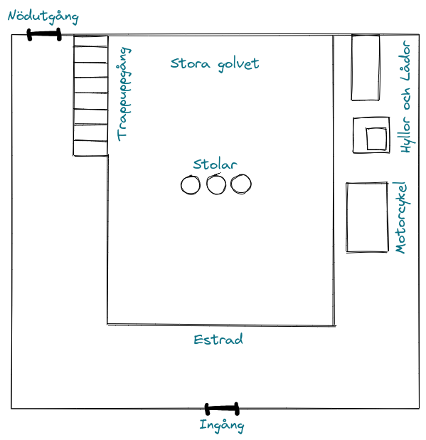

Denna Julsaga utspelar sig i mellandagarna i Göteborg. Utredarna spelar som
"leverantörer", vilket i själva verket är något närmare kriminella och
smugglare. Under denna vinternatt har Utredarna fått i uppgift att "leverera",
eller kidnappa, någon vid namn Albert Fors. Det utredarna inte vet är att Albert
är en liten pojke som varit stygg. Och detta är just vad som krävs för att
frammana den horribla Krampus...


### En vinternatt

> Atlas Leverans är en firma vars specialisering är leveranser av
> juridiskt tveksam natur. Företaget får generellt uppgifter i form av
> smugglade, diskreta leveranser och förvärvande av mycket specifika varor.
>
> Ni har sett mycket underligt med åren. Smugglade vapen, stentavlor med
> underliga inskriptioner införskaffade diskret från museer, samt inburade
> varelser som ni inte kunnat identifiera. Ni har dock hållit huvudet lågt och
> inte ställt frågor; och det är vad som fört er vidare i branschen. Så länge
> varorna transporteras till dess destination, får ni betalt och arbetet är
> utfört.
>
> Tidigare i veckan fick er chef, Simon Jangenfors, en uppgift till er under
> ett möte med en man ”med tysk brytning”. Det är ett underligt jobb, inte ett
> sånt som ni brukar ta. Men det betalar oerhört bra och ska enligt er
> kontaktperson vara ett enkelt jobb.
>
> Er uppgift är att, kvällen den 25 december, införskaffa en viss _Albert Fors_
> från en adress ni redan fått specificerat. Han skall omhändertagas diskret,
> och sedan föras till en industrilokal utanför stan. På väg dit ska ni plocka
> upp Simon, som har adressen för er destination.

Utredarna sitter nu gömda utanför den villa som adressen tillhör. Klockan är
20:00 den 25 december.

Utredarnas uppgift är att plocka upp Albert och sedan köra tillbaks till den
lagerlokal de arbetar ur. Där ska de ansluta sig till Simon, och sedan köra
till industriområdet. För denna uppgift har utredarna tagit med sig en dos 
sömnmedel och en trasa för att söva Albert. Detta räcker dock bara för en 
person.

Det signalement de fått från Simon är att ”han är kort och blond. Ni kommer
förstå direkt när ni ser honom”

Villan har två våningar och liknar i storlek de flesta byggnader i trakten. Den
har en entré på framsidan och en dörr in till köket på baksidan. Ljus strömmar
ut ur alla fönster utom två på övervåningen.



Familjen Fors bor i denna villa. Föräldrarna [Tova](#tova-fors) och
[Herbert](#herbert-fors), samt deras två barn, Greta och Albert. Tova sitter i
vardagsrummet och virkar. H1erbert kommer efter ett tag ut på verandan för att
röka sin pipa.Greta och Albert ligger och sover i varsitt rum på övervåningen.
Herbert och Greta har båda brunt hår, medans Tova och Albert är blonda.

När utredarna kommer upp på övervåningen sker följande.
> När ni kommer in i det släckta rummet ser ni ett hav av leksaker. Golvet är
> fullt av små bilar och olika banor de kan åka i. Längst in i rummet ser ni en
> säng ockuperad av en liten blond pojke. Han kan nog vara kring tio år, och
> ligger i djup sömn.

Lyckas utredarna föra iväg Albert utan att väcka uppsyn kan de ta sig direkt
tillbaks till det lager företaget arbetar ur. Om inte, kommer de bli jagade av
en polisbil som snabbt kommer efter dem.

När utredarna plockar upp Simon är han minst lika förvånad över att Albert bara
är ett barn. Han menar att de säkert ska kräva lösensumma för honom. Nått hot
till föräldrarna säkert.

### Vid industriområdet

> Simon guidar er ut till ett industriområde utanför Luleå. Ni kommer snart
> till en industrilokal, en nedsläckt byggnad med en hög mur i tegel runtom.
> Utanför står en herre i vit rock och röker. "Han är det" säger Simon, och
> kliver ur bilen. "[Herr Ruutki](#herr-ruutki)". Mannen går emot Simon och
> skakar hans hand. "Välkomna" säger han.

Skulle fallet vara nu att någon av utredarna försöker stjäla något från
antingen Ruutli eller en av hans kumpaner, får de tag på en liten flaska
_Opland akvavit_.

Ruutli ber utredarna ta med Albert och leder dem in i lokalen. De leds in i en
mörk korridor med ett antal dörrar på vardera sida. Låt en av dem slå ett slag
för finna dolda ting. Slår det ett normalt lyckat slag noterar att en
[vakt](#vakt) bakom dem låser dörren de kommit in igenom

Sällskapet kommer fram till en man klädd som en insatsoperand. Han har rustning
med hjälm och ett visir som täcker hans mun. [Ruutki](#herr-ruutki) ber
utredarna lämna ifrån sig Albert till mannen, som leder honom in igenom en
dörr.

Ruutki leder sedan vidare sällskapet till ännu en dörr. "Då är det dags att
sköta betalningen, inte sant?".

> Ni går in i ett rum upplyst av en ensam glödlampa hängande från taket. Lampan
> lyser upp ett skrivbord med en industriell laptop på. I rummet finns även en
> hurts och en tom bokhylla. 
> 
> I vid dörren står även två [vakter](#vakt) positionerade ved vardera sida

Ruutki hänger av sig sin kappa och kommer börja fifla med laptopen. Efter ett
tag ber han utredarna vänta lite och han rör sig ut ur rummet. När dörren
stängs höjer plötsligt vakterna sina vapen och skriker "Upp med händerna!"

Utredarna kan ta sig ut ur rummet och ta sig in i den stora kammaren. I Ruutkis
kappa finns en liten flaska _Opland akvavit_. Det finns även en
[anteckningsbok](#anteckningsboken) i hurtsen där besvärjelsen står. 

### Kammaren



> Ni kommer in i en stor kammare som nästan liknar en opera. Ni befinner er
> uppe på en estrad och kan blicka ner på det stora golvet på våningen under. I
> det dåligt upplysta rummet kan ni se en hord av soldater. De verkar förbereda
> för något; de riggar kablar, sopar golv och ställer upp olika lådor med tända
> ljus på. De har ännu inte upptäckt er i det dova ljuset från de små lågorna
> som lyser upp rummet. 

På andra sidan av estraden finns en nödutgång. Mellan utredarna och nödutgången
går dock en trappa upp från det stora golvet. Soldaterna kan snabbt ta sig upp
för trappan och blockera vägen ut.

På estraden finns ett antal stora kartonger och hyllor. Det står även en pall
med en motorcykel på. Bakom dessa kan utredare gömma sig och inte bli sedda.

### Krampus vaknar

**Utredarna fångas**
> Ni leds under pistolhot in i en stor kammare som nästan ser ut som en opera.
> Ni kommer in på en estrad där man kan kan blicka ner på det stora golvet på
> våningen under. I det dåligt upplysta rummet kan ni se en hord av soldater.
> De verkar förbereda för något; de riggar kablar, sopar golv och ställer upp
> olika lådor med tända ljus på.

Låt utredarna slå ett slag för finna dolda ting. Med ett lyckat slag noterar de
nödutgången uppe på estraden. Låt utredarna agera lite under tiden. 

> Ni sätts på varsin stol nere på det stora golvet. Herr Ruutki träder in
> framför er. "Jag ber så mycket om ursäkt, men jag är rädd att vi är i vidare
> behov av er än avtalat." säger han och ler.

**Utredarna är gömda**
> Efter ett tag märker ni hur vakterna börjar positionera sig längst med
> väggarna. De ställer sig i givakt och Ruutki träder fram i ljuset. "Jag är
> rädd att våra vänner inte kunde närvara idag. Men det går att ordna". Ruutki
> pekar på två av vakterna som snabbt grips av de övriga. Vakterna binds och
> placeras på varsin stol som står mitt på golvet. Ni kan höra hur de båda
> bönar och ber för sina liv. 

En vakt klädd likt den utredarna såg tidigare leder Albert och ställer honom
framför utredarna. Samtidigt börjar de åtta andra vakterna positionera sig
längst med väggarna och ställa sig givakt. 

> En stor trälåda rullas in på en kärra. En vakt tar en kofot och öppnar lådan.
> Ruutki sträcker sig ner i lådan och tar upp något ur den. Det är en gammal
> trämask med gethorn i rostigt stål.
> 
> Ruutki talar nu till Albert. "Vill du veta en sak Albert? Jag har talat med
> herr Ytterfält, din rektor. Han berättade för mig att du ställt till med bråk
> på skolgården. Inte sant? Du inledde ett slagsmål med din kamrat, Jonas, och
> han fick tas in på sjukhuset". 
> 
> Ruutki tar masken och sätter den på vakten som står i givakt. "Du har varit
> en mycket elak pojke. Precis vad vi behöver ikväll". 

Låt utredarna flika in under tiden och säga om de vill göra något.

> Ruutki tar fram en flaska och börjar tömma dess innehåll över vakten framför
> sig. Sedan tänder han en tändsticka och sätter eld på mannen, som snabbt
> slukas av flammor.
> 
> Mannen verkar försöka hålla sig från att skrika av oerhörd smärta medans hans
> blottade hud börjar smälta. Rummet lyses upp och ni kan nu se ett dussin
> andra vakter längst väggarna, även dem i givakt.
>
> Ruutki tar fram en anteckningsbok och börjar läsa högt . "Fjättrade bäst, av
> avgrundens djup". Vakterna i rummet upprepar monotont det som sägs. "Träd
> fram ur din slummer av kaos denna decemberdag, och tag det offer vi ger till
> dig; ett offer av ett barn som inte varit snäll, utan stygg, denna jul.
> Bestia tenebrarum, proles Sub Niggurath, tu Krampus".
> 
> Framför er börjar den brinnande mannen att vrida sig. Siluetten av honom
> börjar ryckigt att växa medans ni hör hur dess ben sakta knäcks. Något som nu
> inte längre är en man står framför er. En hårig best på två ben skriker och
> elden som omslöt denna slukas. [Varelsen](#krampus) har röda ögon, en lång
> hängande tunga och hovar och horn av en get. Albert skriker av rädsla.


## Flykten
> [Varelsen](#krampus) störtar emot Ruutki som står stadigt kvar. Han flyr
> inte, utan tilltalar besten. "En snaps åt min herre, för att visa välvilja
> och blidka raseri". Besten verkar stanna upp. 

Om utredarna stulit snaps av Ruutki, försöker han plocka fram en flaska ur en
ficka. Annars ber han snarare vakten att ge honom flaskan. Har de stulit
flaskan från vakten, verkar denne förskräckt och stirrar bara på Ruutki.

Får varelsen snaps tuggar denne i sig hela flaskan, med blod sprutande från
dess mun. Sedan pekar Ruutki på Simon/en bunden vakt, som varelsen sedan ger
sig på. Simon/vakten dör fort. Varelsen börjar slafsa i sig sitt byte.

Om en utredare lyckats stjäla snapsen, blir Ruutki och vakterna förskräckta.
Besten blir rasande och sliter snabbt Ruutki i stycken. Samtliga vakter börjar
skjuta emot varelsen, som rör sig kvickt från en till en och hugger dem med
kraftiga klor.

En utredare kan få slå för psykologi. Med ett normalt lyckat slag kommer denne
ihåg att Simon alltid bär en [pistol](#simons-pistol) i byxlinningen.

Om utredarna tar sig ut, står deras bil kvar. När de kör iväg kan de höra ett
mäktigt vrål från den byggnad som nu står i lågor...

## Material

### Anteckningsboken

Får utredarna tag på anteckningsboken Ruutki hade på sin person, hittar de
följande. 

```
Rit: Bestia tenebrarum, proles Sub Niggurath, tu Krampus

I nödfall: Te bestiam compesce, Sancte Nicolae
```

Riten är vad som yttras för att frammana Krampus.

Om _I nödfall_ besvärjelsen läggs börjar besten att skrika. Den flammar up, och
utredarna kan se tjocka kedjor snärja den och dra den ner i marken.

### Simons Pistol

Simon bär en _7.65mm (.32) Revolver_ i sin byxlinning. Den har följande egenskaper.

| Vapen                 | Färdighet           | Skada | Räckvidd, grund | Eldhastighet | Magasin | Krångel (%) |
|:----------------------|:--------------------|:------|:----------------|:-------------|:--------|:------------|
| 7.65mm (.32) Revolver | Skjutvapen (Pistol) | 1T8   | 15 meter        | 1 (3)        | 6       | 100         |

## Karaktärer

### Herbert Fors

| STY | FYS | STO | SMI | INT | KAR | VST | UTB |
|-----|-----|-----|-----|-----|-----|-----|-----|
| 45  | 50  | 50  | 35  | 55  | 40  | 30  | 40  |

- KP: 5
- Skadebonus: 0
- Kroppsbyggnad: 0
- Förflyttning: 7

Strid:
- Handgemäng 10% (5/2), skada 1T4
- Ducka 10% (7/3)

**Färdigheter**: Finna dolda ting 30%, Bokföring 30%, Språk (Svenska) 25%

### Tova Fors

| STY | FYS | STO | SMI | INT | KAR | VST | UTB |
|-----|-----|-----|-----|-----|-----|-----|-----|
| 35  | 55  | 40  | 55  | 60  | 45  | 30  | 30  |

- KP: 4
- Skadebonus: 0
- Kroppsbyggnad: -1
- Förflyttning: 8

Strid:
- Handgemäng 10% (5/2), skada 1T4
- Ducka 15% (7/3)

**Färdigheter**: Finna dolda ting 20%, Bibliotekskunskap 40%, Språk (Svenska) 45%

### Herr Ruutki

| STY | FYS | STO | SMI | INT | KAR | VST | UTB |
|-----|-----|-----|-----|-----|-----|-----|-----|
| 60  | 60  | 50  | 45  | 70  | 60  | 110 | 75  |

- KP: 10
- Skadebonus: +1T4
- Kroppsbyggnad: 0
- Förflyttning: 7

Strid:
- Handgemäng 40% (20/8), skada 1T4
- Pistol 50% (25/10), skada 1T8
- Ducka 20% (10/4)

**Färdigheter**: Finna dolda ting 30%, Hota 50%, 
Lyssna 30%, Okultism 50%, Cthulhumyten 20%, Språk (Svenska) 20%,
Språk (Tyska) 50%

### Vakt

| STY | FYS | STO | SMI | INT | KAR | VST | UTB |
|-----|-----|-----|-----|-----|-----|-----|-----|
| 70  | 70  | 60  | 40  | 40  | 40  | 80  | 50  |

- KP: 10
- Rustning: 1
- Skadebonus: +1T4
- Kroppsbyggnad: +1
- Förflyttning: 6

Strid:
- Handgemäng 40% (20/8), skada 1T4
- Pistol 50% (25/10), skada 1T8
- Ducka 20% (20/4)

**Färdigheter**: Finna dolda ting 30%, Hota 40%, 
Lyssna 30%, Okultism 20%, Cthulhumyten 5%, Språk (Svenska) 30%

### Krampus

| STY | FYS | STO | SMI | INT | VST |
|-----|-----|-----|-----|-----|-----|
| 140 | 120 | 160 | 50  | 20  | 110 |

- KP: 30
- Rustning: 2
- Skadebonus: +3T6
- Kroppsbyggnad: +4
- Förflyttning: 9

Strid:
- Attacker per runda: 2
- Strid (Klor, bett) 45% (22/9), skada 1T6 + SB
- Ducka: 35%
- Sinnesbelastning: 0/1T10
